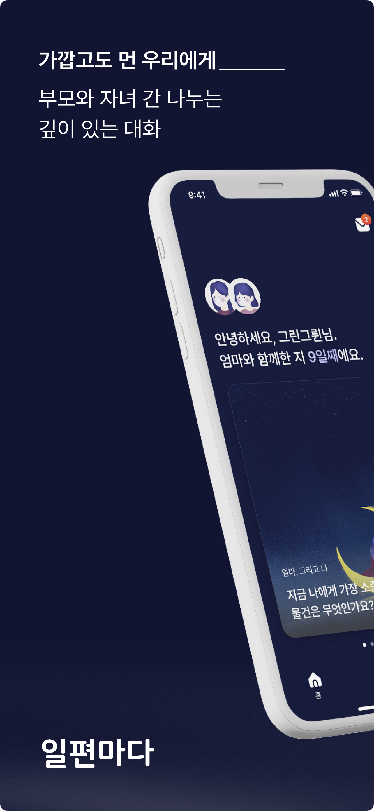
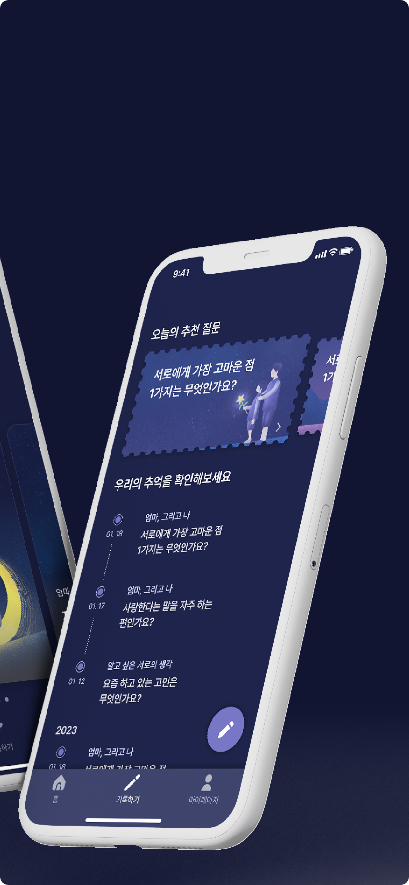
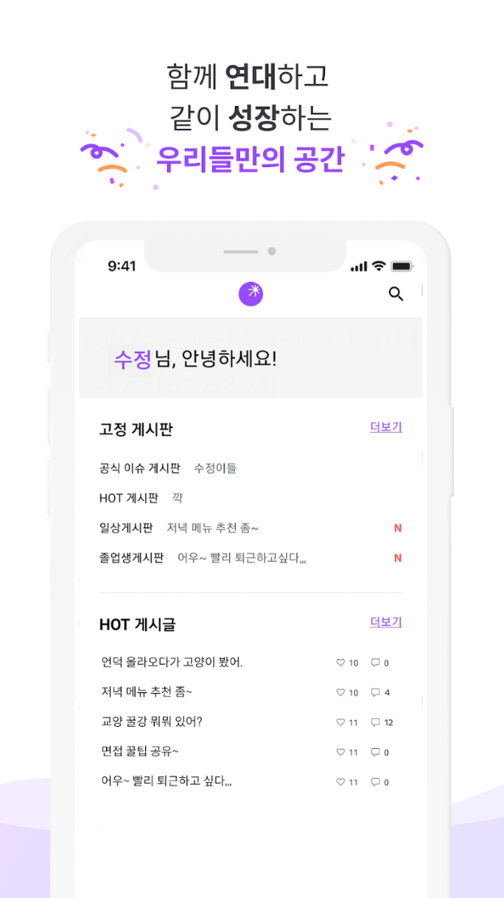

# Portfolio

## 백윤서  
### Front-End Developer (Web)

#### **Email** : gye04056@naver.com   
#### **Blog** : https://velog.io/@bgyoons
 

> 사용자 경험을 중요시 여기고, UX 개선에 많은 고민을 합니다.
>
>코드 재사용성에 관심이 많습니다.
>
>논리적인 코드를 작성하려고 노력합니다.
>
>성장을 지향합니다.

 

# **목차**
1. [경력](#경력)  

2. [활동](#활동)  
  
3. [프로젝트 요약](#프로젝트-요약)  

4. [프로젝트 상세](#프로젝트-상세)  
  
5. [학력](#학력)  

 

# **경력**
| 기간 | 회사 명 | 내용     |
|:----|:---------|:--------|
| 2022.06 ~ 재직중 |  **(주)에임드** *구) 게임베리* |  **서비스 개발팀 소속**  프론트엔드 개발자  Vue로 작업된 피리마켓 유지보수 작업 [자사 홈페이지](#aimed), [게임 랜딩페이지](#wild-catch--ranch) 퍼블리싱 작업| 
 

# **활동**
| 기간 | 활동명 | 내용     |
|:----|:---------|:--------|
| 2023.01 ~ 2023.03 | Central MakeUs Challenge 웹 파트 | 수익형 앱 련칭 IT 동아리  **활동 프로젝트** : [일편마다](#일편마다) |
| 2021.05 ~ 2022.03 | 성신여대 자체 커뮤니티 개발팀 Salty Lab | 성신여대 동문들이 소통할 수 있는 커뮤니티를 만들기 위한 개발팀   **활동 프로젝트** : [수정광산](#수정광산) |
| 2021.03 ~ 2021.10 | 멋쟁이 사자처럼 9기 | 개발동아리 회원으로 활동   Django 프레임워크를 이용한 블로그 만들기 실습 및 자체 스터디 진행 |
 

# **프로젝트 요약**

| 기간 | 프로젝트 명 | 내용     |
|:----|:---------|:--------|
| 2023.01 ~ 2023.03 | **[일편마다](#일편마다)** *몽글* |  **PART** : App Front-End (기여도 40%)   **LIST** : 스플래시, 로그인/회원가입, 메인페이지, 메시지함, 앱 스토어 배포   **STACK** : `React Native`, `TypeScript`, `Redux`, `React Query` |
| 2023.01 ~ 2023.03 | **[WILD CATCH & RANCH](#wild-catch--ranch)** *(주)에임드* |  **PART** : Web Publishing (기여도 70%)   **STACK** : `HTML`, `CSS`, `JQuery` |
| 2023.01 ~ 2023.03 | **[AIMED](#aimed)** *(주)에임드* |  **PART** : Web Publishing (기여도 40%)   **LIST** : HOW WE WORK, CAREERS   **STACK** : `HTML`, `CSS`, `Javascript` |
| 2021.05 ~ 2022.03 | **[수정광산](#수정광산)**    *성신여대 자체 커뮤니티 개발팀   Salty Lab* | **PART** : App Front-End (기여도 20%)   **LIST** : UI 커스텀 컴포넌트, 스플래시 화면, 회원가입/회원탈퇴, 게시판/게시글 검색 및 검색 결과 조회, 성신 위키 탭 게시판, 문의하기/게시글 작성   **STACK** : `React Native`, `TypeScript` |
 

# **프로젝트 상세**
## 일편마다

### 앱 스토어 출시
- [다운받기](https://apps.apple.com/kr/app/%EB%B6%80%EB%AA%A8%EC%99%80-%EC%9E%90%EB%85%80-%EA%B0%84%EC%9D%98-%EA%B9%8A%EC%9D%80-%EB%8C%80%ED%99%94-%EC%9D%BC%ED%8E%B8%EB%A7%88%EB%8B%A4/id6446275837) 

### 상세 내용

- 일편마다는 대화가 가장 필요하지먼, 가장 속마음을 털어놓기 어려운 사이인 부모와 자녀를 타겟으로 잡았습니다.
- 쌍방향적인 소통을 통해 서로를 알아가고, 부모-자녀 간 유대감 형성을 도와주는 서비스 입니다.
- 부담없이 작성하고 서로 공유하는 일기로 서로를 이해할 수 있도록 도와줍니다.

### 사용 기술

- React Native
- TypeScript
- Redux
- React Query

### 담당 기능
- 스플래시
- 로그인/회원가입
- 메인페이지(홈)
- 메시지함
- 앱 스토어 배포

### 깨달은 점
- 초기 셋팅을 하면서 버전 관리를 하고 폴더 구조도 미리 잡으면 팀 프로젝트를 하기에 편하다.
- React Query는 자동 패치, 캐싱, 무한 스크롤 등 비동기 과정을 쉽게 처리해주고, 서버 쪽 데이터 관리에 적합하다.
- 앱 스토어 출시를 위해서는 안내 문구, 이용자 약관, 기능의 완성도 등 고려해야 하는 것이 많다.

---
## [WILD CATCH & RANCH](https://wildcatchandranch.com/) 

### 상세 내용
- 트라이베카 팀에서 만든 게임 WILD CATCH & RANCH 랜딩 페이지 입니다.
- html, css, jquery를 사용하여 퍼블리싱 및 인터렉션 작업을 하였습니다.

### 깨달은 점
- 동영상이나 스타일은 크롬, 사파리 등 다양한 브라우저에서 호환을 확인해야 한다.
- 빠르고 직관적으로 이해할 수 있는 클린 코드로 짜는 것이 후에 유지보수를 위해 중요하다.

---
## [AIMED](https://aimed.xyz/) 

### 상세 내용
- AIMED 회사의 홉페이지 입니다.
- HOW WE WORK, CAREERS 작업을 진행하였습니다.
- html, css, javascript를 사용하여 퍼블리싱 및 인터렉션 작업을 하였습니다.

### 깨달은 점
- 특정 섹션마다 블록 스코프(`{}`)를 지정하여 코드를 짜면 해당 섹션에서만 사용할 변수나 함수를 스코프 내에서만 사용할 수 있어 재선언이나 재할당의 위험에서 벗어나 작업하기 용이하다.
- 아이폰 절전모드가 켜져 있는 경우에는 `video` 태그의 `autoplay` 속성이 제어된다.
- 웹 페이지를 제작할 때 컨텐츠가 들어갈 너비를 1000 ~ 1200px 정도로 지정하여 작업하면 통일된 레이아웃으로 작업하기에 용이하다.
- `HTML5`의 `dataset`(`data-*`) 속성을 사용하면 정의하고자 하는 속성을 지정하여 사용자 변수를 만들 수 있다.
- `a` 태그의 `href="#id"`를 사용해 페이지 내에서 특정 위치로 이동할 수 있다.

---
## 수정광산

### 상세 내용

- 성신여대 학생들만이 이용할 수 있는 **성신여대 자체 커뮤니티** 앱 입니다.
- 성신여대를 생활하며 수강 신청, 주변 상권 등 필요한 정보를 한 곳에서 확인할 수 있도록 성신 위키를 제작하였습니다.
- 게시판 생성과 자유로운 글 작성, 스크랩을 통해 성신여대 동문들끼리의 소통을 할 수 있습니다.

### 사용 기술

- React-Native
- TypeScript

### 담당 기능
- UI 커스텀 컴포넌트
- 스플래시 화면
- 회원가입/회원탈퇴
- 게시판/게시글 검색, 검색 결과 조회
- 성신 위키 탭 게시판
- 문의하기/게시글 작성

### 깨달은 점
- React Native는 JavaScript로 되어있는 모바일 앱 개발 언어이다.  
- JavaScript와 React를 알면 Android와 iOS를 동시에 개발할 수 있는 장점이 있다. 
- 컴포넌트에 무한스크롤이나 새로고침을 위한 props를 제공해주어 편리하게 개발할 수 있다.