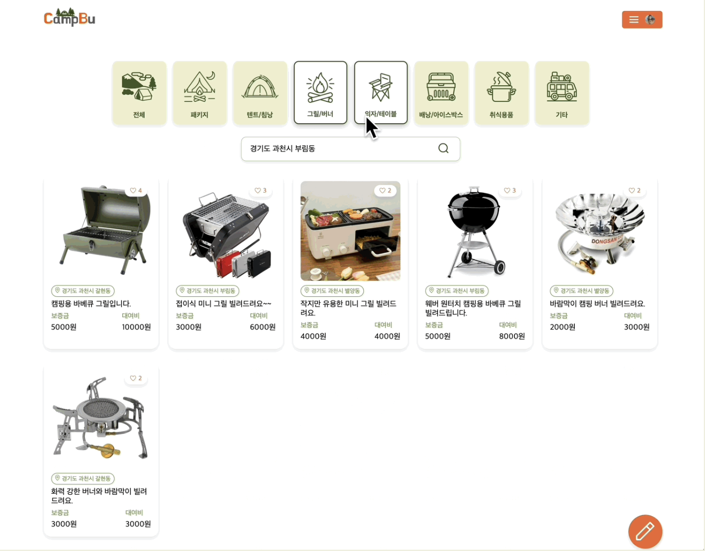
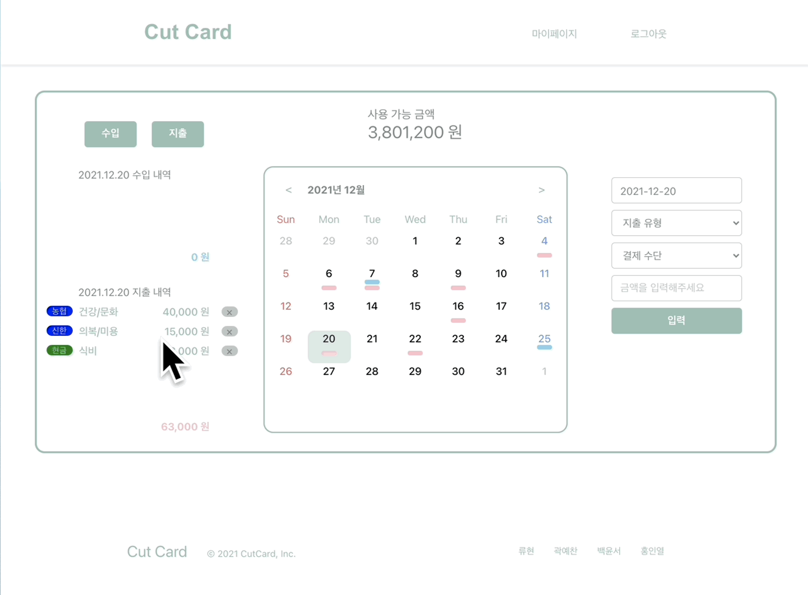

# Portfolio

## 백윤서  
### Front-End Developer (Web)
 

#### **Email**  
*gye04056@naver.com*   
#### **Blog**   
*https://velog.io/@bgyoons*
#### [*Notion 포트폴리오*](https://bgyoons.notion.site/dd862ebdaea54baba42f837317279134)
 

>  사용자 경험을 중요시 여기고, UX 개선에 많은 고민을 합니다.
>
>코드 재사용성에 관심이 많습니다.
>
>성장을 지향합니다.   

 

# **목차**
1. [경력](#경력)  

2. [활동](#활동)  
  
3. [프로젝트 요약](#프로젝트-요약)  

4. [프로젝트 상세](#프로젝트-상세)  
  
5. [학력](#학력)  

  

# **경력**
| 기간 | 회사 명 | 내용     |
|:----|:---------|:--------|
| 2022.06 ~ 재직중 |  **(주)에임드** *구) 게임베리* |  **서비스 개발팀 소속**  반려동물 산책앱(피리부는 강아지) 프론트엔드 개발자  **[프로젝트]** 피리부는 강아지 앱 내부에 외주사가 운영해오던 피리마켓과 피리마켓 어드민 페이지 개발 **피리마켓** : 외주사가 작업한 Vue 소스를 리액트로 변경 작업 **STACK** : `React`, `JavaScript`, `Axios`, `Recoil`, `styled-components` **피리마켓 어드민** : 기존 메타커머스 어드민 페이지를 자체 어드민 페이지로 내제화 진행 **STACK** : `React`, `JavaScript`, `React-Query`, `Recoil`, `styled-components`   | 
|

  

# **활동**
| 기간 | 프로젝트 명 | 내용     |
|:----|:---------|:--------|
| 2021.05 ~ 2022.08 | 성신여대 자체 커뮤니티 개발팀 Salty Lab | 성신여대 동문들이 소통할 수 있는 커뮤니티를 만들기 위한 개발팀   **활동 프로젝트** : [수정광산](#수정광산) |
| 2021.08 ~ 2022.01 | 코드스테이츠 Software Engineering Bootcamp 34기  | Javascript 기반 풀스택 과정 이수   **활동 프로젝트** : [CampBu](#CampBu),  [CutCard](#CutCard) |
| 2021.03 ~ 2021.10 | 멋쟁이 사자처럼 9기 | 개발동아리 회원으로 활동   매주 교육 세션 진행 및 학생들끼리 자체 스터디 진행 |
|

  

# **프로젝트 요약**

| 기간 | 프로젝트 명 | 내용     |
|:----|:---------|:--------|
| 2021.05 ~ 2022.08 | **[수정광산](#수정광산)**    *성신여대 자체 커뮤니티 개발팀   Salty Lab* | **PART** : App Front-End (기여도 30%)   **LIST** : UI 커스텀 컴포넌트, 스플래시 화면, 회원가입/회원탈퇴, 게시판/게시글 검색 및 검색 결과 조회, 성신 위키 탭 게시판, 문의하기/게시글 작성   **STACK** : `React Native`, `TypeScript` |
| 2021.12 ~ 2022.01 | **[CampBu](#campbu)**    *코드스테이츠   Final Project* | **PART** : Web Front-End (기여도 50%)   **LIST** : UI 커스텀 컴포넌트(모달), 상품 검색, 상품 목록 카테고라이징, 찜하기, 마이페이지, 메시지함 내 예약 및 대여 관리   **STACK** : `React`, `TypeScript`, `Recoil`, `Emotion.js` |
| 2021.12 ~ 2021.12 (2주) | **[CutCard](#cutcard)**    *코드스테이츠   Toy Project* | **PART** : Web Front-End (기여도 50%)   **LIST** : 회원가입, 로그인, 마이페이지   **STACK** : `React`, `JavaScript`, `styled-components` |

  

# **프로젝트 상세**
## 수정광산

### 상세 내용

- 성신여대 학생들만이 이용할 수 있는 **성신여대 자체 커뮤니티** 앱 입니다.
- 성신여대를 생활하며 수강 신청, 주변 상권 등 필요한 정보를 한 곳에서 확인할 수 있도록 성신 위키를 제작하였습니다.
- 게시판 생성과 자유로운 글 작성, 스크랩을 통해 성신여대 동문들끼리의 소통을 할 수 있습니다.

### 사용 기술

- React-Native
- TypeScript

### 담당 기능
- UI 커스텀 컴포넌트
- 스플래시 화면
- 회원가입/회원탈퇴
- 게시판/게시글 검색, 검색 결과 조회
- 성신 위키 탭 게시판
- 문의하기/게시글 작성

### 깨달은 점
- React Native는 JavaScript로 되어있는 모바일 앱 개발 언어이다.  
- JavaScript와 React를 알면 Android와 iOS를 동시에 개발할 수 있는 장점이 있다. 
- 컴포넌트에 무한스크롤이나 새로고침을 위한 props를 제공해주어 편리하게 개발할 수 있다.

 

---
 

## CampBu

### Repository & Wiki

- [Repository](https://github.com/codestates/Campbu)
- [위키](https://github.com/codestates/Campbu/wiki)

### 상세 내용

- 사용자 위치 주변에 있는 대여 가능한 캠핑 물품을 확인할 수 있습니다.
- 마음에 드는 캠핑 물품을 찜하기 버튼을 통해 목록에 저장할 수 있습니다.
- 대여 가능한 캠핑 물품을 예약할 수 있습니다.
- 대여 예약시 대여자와 실시간 채팅을 통해 상세한 대여 조건 및 대여 방법을 조율할 수 있습니다.
- 대여 후 캠핑물품 반납시 빌려준 사람, 빌린 사람에 대한 리뷰항목으로 작성할 수 있습니다.

### 사용 기술

- React 
- TypeScript
- Recoil
- Emotion.js

### 담당 기능

- 상품 검색 기능 구현
- 상품 목록 페이지 카테고리 기능, 상품 찜하기 구현
- 마이페이지, 메시지함 내 예약 및 대여 관리 기능 구현
- 예약 및 대여 상태에 따라 다른 모달창 구현
- 와이어프레임, 프로토타입 제작

### 깨달은 점

- TypeScript로 타입을 지정함으로써 자동완성이나 타입확인을 통해 빈 값이나 잘못된 타입, 오타 등 사전에 실수를 방지할 수 있었다.
- Recoil은 React와 호환이 뛰어나고 React Hook과 상당히 유사하다.
- Props drilling을 방지하고자 Recoil을 채택하였다.
- Emotion jsx에서 제공해주는 css 속성을 활용하면 이를 클래스로 변환해준다.
- css props를 결합하여 복잡한 스타일링을 적용하거나 css 변수를 조립하여 컴포넌트 스타일링을 적용할 수 있다.

 

---
 

## CutCard

### Repository & Wiki

- [Repository](https://github.com/codestates/Cutcard)
- [위키](https://github.com/codestates/Cutcard/wiki)
### 상세 내용

- 수입, 지출이 발생한 날짜에 카테고리 별로 금액을 입력하여 달력에 기록해 놓을 수 있습니다.
- 회원가입 시 현재 보유한 카드를 입력하고 앞으로 더 이상 쓰고 싶지 않은 카드를 설정할 수 있습니다.
- 쓰고 싶지 않은 카드의 카드값이 0원이 되는 날 로그인 시 카드를 해지할 수 있다는 알림과 고객센터, 웹사이트의 정보를 알립니다.

### 사용 기술

- React
- JavaScript
- Styled-Component

### 담당 기능

- 회원가입, 로그인 기능 구현
- 마이페이지 기능 구현
- 와이어프레임, 프로토타입 제작

### 깨달은 점

- Github Issues를 사용하면서 효율적으로 업무 분담을 할 수 있게 되었다.
- Git Workflow에 대해 이해를 하였다.

  

# **학력**

#### 2017.03 ~ 2022.02 성신여자대학교 수학과(주전공) / 서비스디자인공학과(부전공)