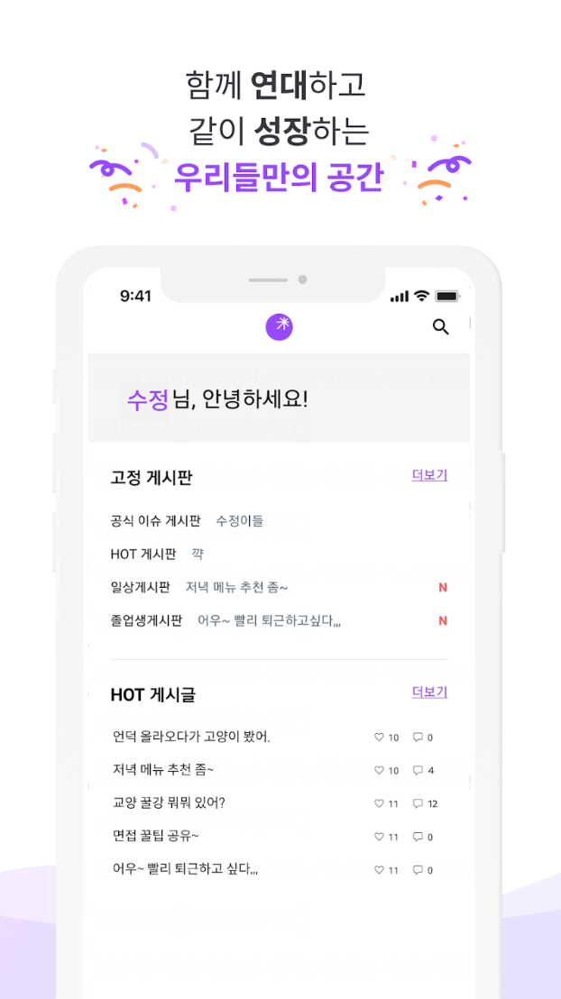

# Portfolio

## 백윤서  

### [Notion 포트폴리오](https://bgyoons.notion.site/dd862ebdaea54baba42f837317279134)

#### Front-End Developer 

**1997.07.10**  
email - gye04056@naver.com  
github - http://github.com/bgyoons  
blog - https://velog.io/@bgyoons  

```
사용자 경험을 중요시 여기고, UX 개선에 많은 고민을 합니다.

코드 재사용성에 관심이 많습니다.

성장을 지향합니다.
```

<br>

# **목차**
1. [경력](#경럭)  

1. [활동](#활동)  
  2-1. 성신여대 자체 커뮤니티 개발팀 Salty Lab  
  2-2. 코드스테이츠 Software Engineering Bootcamp 34기  
  2-3. 멋쟁이 사자처럼 9기  
  
2. [프로젝트 요약](#프로젝트-요약)  

3. [프로젝트 상세](#프로젝트-상세)  
  
1. [학력](#학력)  

<br><br>
# **경럭**
| 기간 | 회사 명 | 내용     |
|:----|:---------|:--------|
| 2022.06 – 재직중 | <br>(주)에임드<br>*구) 게임베리* | **서비스 개발팀 소속** <br>반려동물 산책앱(피리부는 강아지) 프론트엔드 개발자<br>- 피리부는 강아지 앱 내부에 외주사가 운영해오던 피리마켓과 피리마켓 어드민 페이지 개발<br>- 피리마켓 : 외주사가 작업한 Vue 소스를 리액트로 변경 작업<br>- `React`, `JavaScript`, `Axios`, `Recoil`, `styled-components`<br>- 피리마켓 어드민<br>기존 메타커머스 어드민 페이지를 자체 어드민 페이지로 내제화 진행<br>- `React`, `JavaScript`, `React-Query`, `Recoil`, `styled-components` |


<br><br>
# **활동**
| 기간 | 프로젝트 명 | 내용     |
|:----|:---------|:--------|
| 2021.05 – 2022.08 | 성신여대 자체 커뮤니티 개발팀<br>Salty Lab | 성신여대 동문들이 소통할 수 있는 커뮤니티를 만들기 위한 개발팀 <br> 활동 프로젝트 : [수정광산](#수정광산) |
| 2021.08 - 2022.01 | 코드스테이츠<br>Software Engineering Bootcamp 34기  | Javascript 기반 풀스택 과정 이수 <br> **활동 프로젝트** : [CampBu](#CampBu),  [CutCard](#CutCard) |
| 2021.03 - 2021.10 | 멋쟁이 사자처럼 9기 | 개발동아리 회원으로 활동 <br> 매주 교육 세션 진행 및 학생들끼리 자체 스터디 진행 |
|

<br><br>

# **프로젝트 요약**

| 기간 | 프로젝트 명 | 내용     |
|:----|:---------|:--------|
| 2021.05 – 2022.08 | **[수정광산](#수정광산)**  <br> *성신여대 자체 커뮤니티 개발팀 <br> Salty Lab* |  <br> **PART** :  <br> **LIST** :  <br> **STACK** :  |


<br><br><br>


# **프로젝트 상세**
## 수정광산


---
## CampBu


---
## CutCard

---

# **학력**